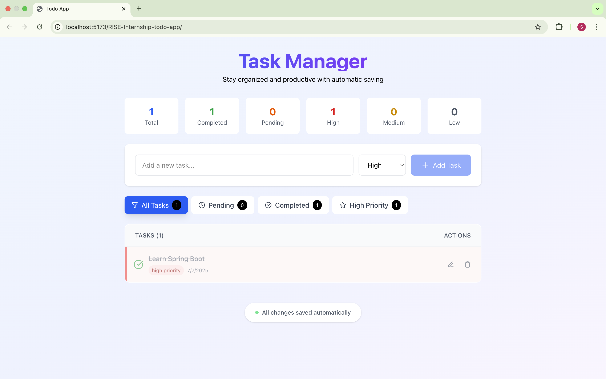
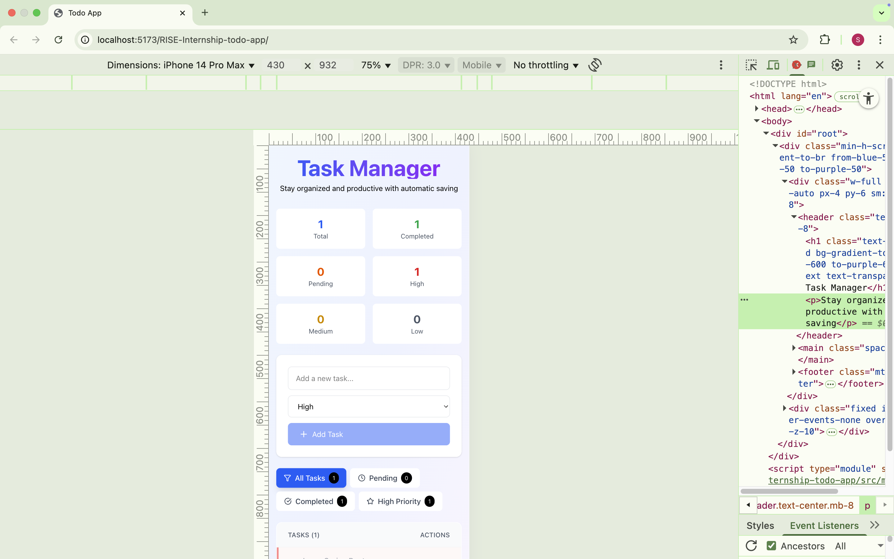

#  Task Manager App

Stay organized and productive with this **Task Manager App**, designed to help users efficiently track, prioritize, and manage daily tasks with automatic saving and filtering options.

---

Live Link: https://rise-taskapp.netlify.app/


##  About the Project

This project was developed as part of the **RISE Internship 2025**.  
It allows users to:
- Add new tasks
- Assign priority levels (High, Medium, Low)
- Mark tasks as completed
- Filter tasks by status or priority
- Save all changes automatically (no manual save required)

---

##  Tech Stack

- **React.js**
- **Tailwind CSS**
- **JavaScript (ES6+)**
- **Local Storage** (for saving tasks automatically)
- **Responsive Design** (Mobile-friendly)

---

## Screen Record


## 🖥️ Desktop View



---

## 📱 Mobile View



---

## 🚀 How to Run the Project Locally

1. **Clone the repository**
```bash
git clone https://github.com/S-Vignesh-Programmer/RISE-Internship-TaskApp.git

2. Navigate into the project

cd task-app

3. Install dependencies

npm install

4. Start the development server

npm run dev


Features
 
 Add, edit, delete tasks
 Mark tasks as completed
 Filter by status or priority
 Auto-save with Local Storage
 Fully responsive design
 Clean UI with light background

Author

Vignesh Java Full Stack Developer
This project is made for learning and internship purpose only